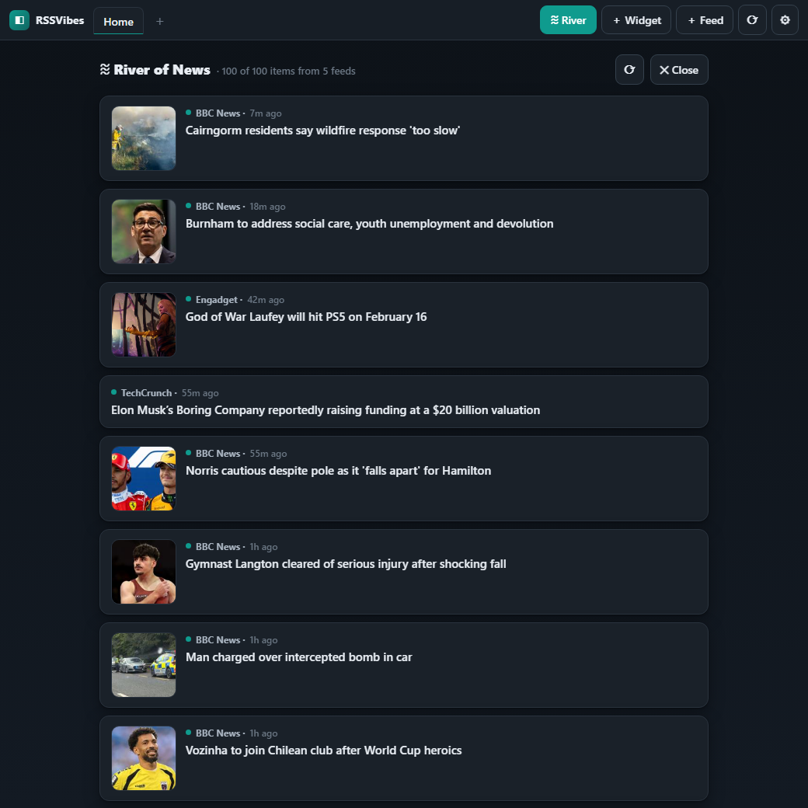

# RSSVibes

A personal, **Netvibes- and DashDork-inspired** RSS reader / start page that runs
entirely on your own machine. Tabbed pages, a drag-and-drop grid of widgets, RSS/Atom
feed portlets, a weather widget, notes, a clock and bookmarks — all saved locally to
`data/state.json`. No account, no cloud, no external services (except the feeds and
weather data you choose to load).




## Run it

**As a desktop app** (Windows) — double-click **`RSSVibes.vbs`**. It starts the server and
opens RSSVibes in its own chromeless window (Edge/Chrome "app mode"), then shuts the server
down when you close the window. No console, no browser tabs — it feels like a native app.

**In your browser** — double-click **`start.bat`**, or from a terminal:

```bash
"C:\msys64\mingw64\bin\python.exe" server.py
```

Then open <http://127.0.0.1:8787/>. `start.bat` opens it for you.

Requires only Python 3 (uses the standard library — no `pip install`). It's wired to the
Python that ships with your MSYS2 install; any Python 3.8+ works if you'd rather use another.
The desktop-app launcher additionally needs Edge or Chrome installed (it falls back to your
default browser otherwise).

## Why a local server (and not just an HTML file)

Browsers block cross-origin requests, so a pure static page can't fetch most RSS feeds.
`server.py` fetches and parses feeds **server-side** and hands the browser clean JSON,
which is what makes the feeds actually load. It also:

- discovers a site's feed when you paste its homepage URL (`/api/discover`)
- caches feed responses for ~90s to be polite to publishers
- stores your whole dashboard in `data/state.json` (export/import from ⚙ Settings)

## Using it

| Action | How |
| --- | --- |
| Add a feed | **＋ Feed** — paste a feed URL *or* a site homepage |
| Add a widget | **＋ Widget** — Feed, Weather, Notes, Clock or Bookmarks |
| Weather | Add a **Weather** widget, then set a city — current conditions + 4-day forecast |
| Rearrange | Drag a widget by its **header** between columns |
| New page | **＋** next to the tabs |
| Page settings | Double-click a tab — rename it or set its **column count** (1–5, per page) |
| Theme & accent | **⚙** in the top-right |
| Read an article | Click an item → reading pane slides in |
| River of News | **≋ River** in the top bar — every feed merged into one chronological stream |
| Import subscriptions | **⚙ → Import Netvibes / OPML** — a Netvibes `.zip`/`.opml` export or any OPML file |
| Export subscriptions | **⚙ → Export Netvibes / OPML** — save your feeds as a Netvibes-compatible OPML file |

## Importing & exporting (Netvibes / OPML)

Migrating from Netvibes? Export your subscriptions (Netvibes gives you a `.zip`
containing an OPML file), then open **⚙ Settings → Import Netvibes / OPML** and pick the
file. RSSVibes reads the zip directly — no need to unpack it — and recreates each Netvibes
**tab as a page**, preserving the column and row layout of every feed. Netvibes-specific
widgets that aren't RSS feeds (saved searches, etc.) are skipped, and imported feeds are
**added** as new pages so your existing dashboard is left intact. Imported feeds are written
to `data/state.json` immediately (not on a delay), so they're all there the next time you
open RSSVibes — even if you close the app right after importing.

Going the other way, **⚙ Settings → Export Netvibes / OPML** writes your feeds back out as a
Netvibes-compatible OPML file (pages become tabs, with per-feed column/row positions), so you
can move them into another reader — or back into RSSVibes. Because it's the same format the
importer reads, RSSVibes round-trips its own exports losslessly. OPML only describes feeds, so
notes/clock/bookmark widgets aren't included — use **Export JSON** for a complete backup.

Plain OPML exports from Feedly, Inoreader, The Old Reader and similar readers work too.

## Files

```
server.py        local server: static files + feed proxy + weather + OPML + state
web/index.html   app shell
web/styles.css   theme (light/dark + accent colors)
web/app.js       dashboard logic (state, drag-drop, feeds, reader, river, modals)
RSSVibes.vbs     desktop-app launcher (double-click) — opens an app-mode window
rssvibes.ps1     launcher script it runs (server lifecycle + app window)
start.bat        browser-tab launcher
data/state.json  your saved dashboard (created on first run)
```

## Notes

- The server binds to `127.0.0.1` only — it is not reachable from other machines.
- Change the port with an env var: `PORT=9000 python server.py`.
- The weather widget uses the free [Open-Meteo](https://open-meteo.com/) API — no key
  required; it geocodes the city name you type and caches results for 10 minutes.
- Bookmark favicons load from Google's public favicon service; everything else is local.

## Changelog

### v0.3.0

- **River of News** — a new **≋ River** view that merges every feed across all pages into
  one reverse-chronological stream; click any item to read it, closes back to the dashboard.
- **Desktop app** — `RSSVibes.vbs` launches RSSVibes in a chromeless app-mode window and
  ties the local server's lifetime to that window (no console, no browser tabs).
- **Per-page column counts** — each page has its own column count (1–5); set it by
  double-clicking a tab. OPML import and export preserve every page's column layout.

### v0.2.0

- **Netvibes / OPML import** — bring your feeds in from a Netvibes `.zip`/`.opml` export
  or any OPML file (Feedly, Inoreader, …). Netvibes tabs become pages, each feed's
  column/row position is preserved, and non-RSS widgets are skipped.
  (**⚙ Settings → Import Netvibes / OPML**)
- **Netvibes / OPML export** — save your feeds back out as a Netvibes-compatible OPML
  file; round-trips losslessly with the importer.
  (**⚙ Settings → Export Netvibes / OPML**)
- **Weather widget** — current conditions plus a 4-day forecast for any city, via the
  free, keyless [Open-Meteo](https://open-meteo.com/) API; metric or imperial units.
  (**＋ Widget → Weather**)
- **Fix** — the modal/reader overlay no longer stays on top of the page: previously it
  blurred the whole dashboard and blocked all mouse and keyboard input.

### v0.1.0

- Initial release: tabbed pages, a drag-and-drop widget grid, RSS/Atom feed widgets with
  a reading pane, Notes / Clock / Bookmarks widgets, light/dark themes with accent colors,
  and local `state.json` persistence with JSON export/import. Zero dependencies (Python
  standard library only).
